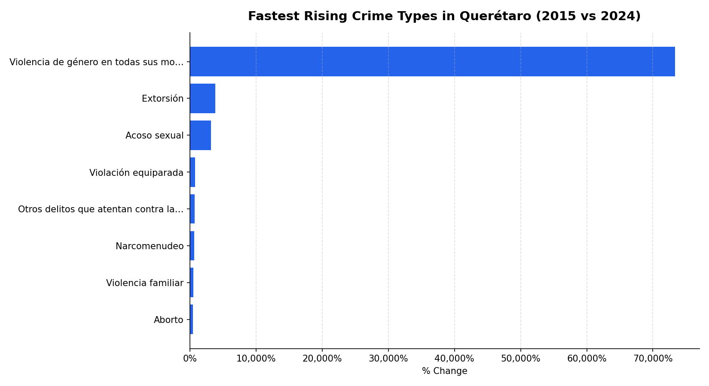

# Mexico Public Safety Analysis — Querétaro

Analysis of reported crime incidents in Querétaro, Mexico from 2015 to 2025, using official federal data from the Secretariado Ejecutivo del Sistema Nacional de Seguridad Pública (SESNSP).

Querétaro has gone through unusually fast population and industrial growth over the past decade. I wanted to see whether the crime data actually reflected that growth, how local trends compare to the rest of the country, and which categories were driving the numbers versus which ones just felt like they were.

---

## Key Findings

- Incidents grew from 32,817 in 2015 to a peak of 63,334 in 2023 (+72.3%), then declined to 56,559 by 2025.
- **Robo (theft)** dominates the totals — 255,622 incidents across the decade, far ahead of any other category.
- Seasonality exists but is mild: October is the highest month, April the lowest, a ~9.6% gap.
- Querétaro has stayed **below the national per-state average every single year**, averaging roughly 8,000 fewer incidents annually than the typical Mexican state.
- Gender-based violence shows the largest proportional increase of any category between 2015 and 2024. The percentage is enormous because the 2015 baseline was tiny — this almost certainly reflects changes in legal classification and reporting practices rather than an equivalent rise in actual incidents. The trend is real and worth flagging, but the headline percentage by itself is misleading without that context.

---

## Charts

### Reported Crime Incidents by Year (2015–2025)


### Top 10 Crime Types (All Years Combined)


### Seasonal Crime Patterns


### Querétaro vs National Average per State


### Largest Relative Changes by Crime Category (2015 vs 2024)


---

## Questions Explored

1. How have reported crime incidents in Querétaro changed year over year?
2. Which crime categories drive the totals?
3. Are there seasonal patterns by month?
4. How does Querétaro compare to the national per-state average?
5. Which crime types are changing fastest, in either direction?

---

## Data Cleaning Notes

The raw SESNSP files needed more work than I expected:

- The yearly format is **wide** (one column per month × year), so I reshaped it into long format (one row per state-category-month-year) to make SQL queries reasonable.
- Some category names changed between years (added subtypes, renamed crimes after legal reforms). I normalized these to a single canonical name per category so trends weren't broken across the renaming year.
- Column header casing and accent usage were inconsistent across files. Stripped accents and standardized to snake_case during load.
- The 2026 partial file uses a slightly different schema than the 2015–2025 historical file, so they're loaded separately and unioned downstream.

---

## Project Structure

```
mexico-public-safety-analysis/
├── data/
│   ├── raw/                  ← original CSVs from datos.gob.mx (untouched)
│   ├── cleaned/              ← reshaped long-format CSV
│   └── mexico_safety.db      ← SQLite database
├── sql/
│   └── queries.sql           ← analytical queries with comments
├── output/
│   ├── charts/               ← 5 exported PNG charts
│   └── report.md             ← auto-generated markdown report
├── analysis.py               ← data loading and cleaning
├── load_db.py                ← loads cleaned CSV into SQLite
├── visualizations.py         ← generates all 5 charts
├── generate_report.py        ← builds output/report.md from query results
└── .gitignore
```

---

## Stack

Python (pandas) for loading and reshaping, SQLite for analytical queries, matplotlib for charts. I went with SQLite instead of Postgres because the dataset fits comfortably in a single file and I wanted the repo to be self-contained — anyone cloning it can run the whole pipeline without setting up a database server.

---

## Data Source

**Secretariado Ejecutivo del Sistema Nacional de Seguridad Pública** — [datos.gob.mx](https://datos.gob.mx), *Cifras de incidencia delictiva estatal*.

- `Estatal-Delitos-2015-2025_feb2026.csv` — historical data 2015–2025
- `RNID-Delitos_Estatal-2026-feb2026.csv` — 2026 partial data (Jan–Feb)

Both files are kept untouched in `data/raw/`.

---

## Limitations

- SESNSP figures reflect **reported** incidents only. Mexico has well-documented underreporting (the INEGI ENVIPE survey consistently estimates a "cifra negra" above 90% nationally), so absolute numbers should not be read as total crime occurrence.
- Reporting standards and legal classifications changed during the analysis window. The gender-based violence finding is the clearest example, but other categories are likely affected to smaller degrees.
- 2025 data may still be revised in later SESNSP publications.
- I did **not** normalize by population. Querétaro's population grew substantially over the decade, so part of the raw incident growth is mechanical. A per-capita pass would be a natural follow-up.
- Comparison to the "national per-state average" uses a simple mean across 32 states and does not weight by population. It's useful as a rough benchmark, not a rigorous one.

---

## How to Run

```bash
# 1. Clean and reshape raw data
py analysis.py

# 2. Load into SQLite
py load_db.py

# 3. Generate charts
py visualizations.py

# 4. Generate report
py generate_report.py
```

Output appears in `output/charts/` and `output/report.md`.
