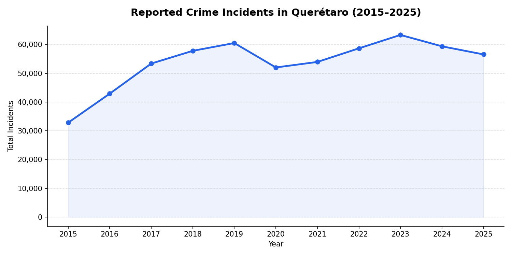
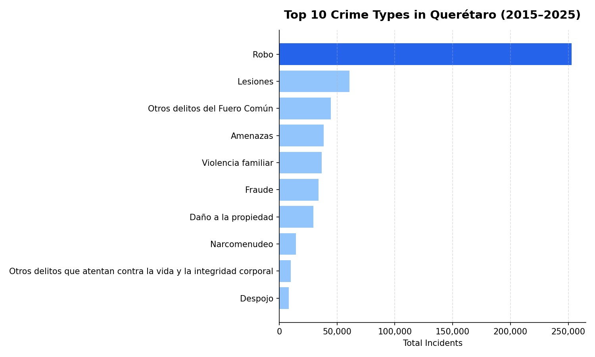
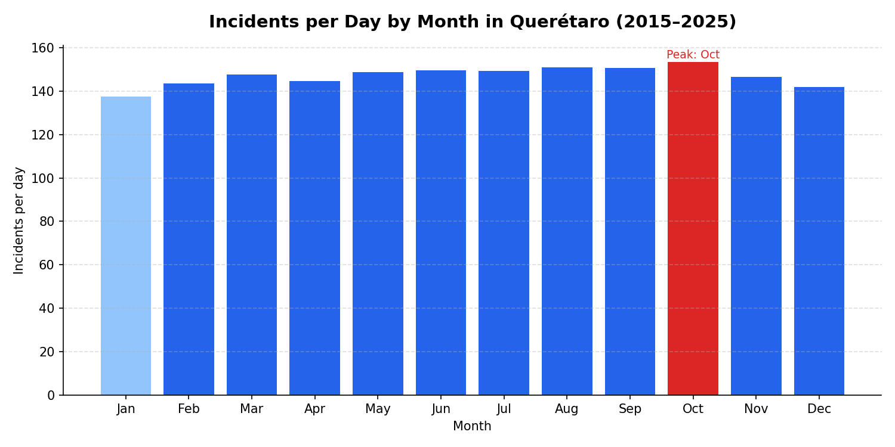
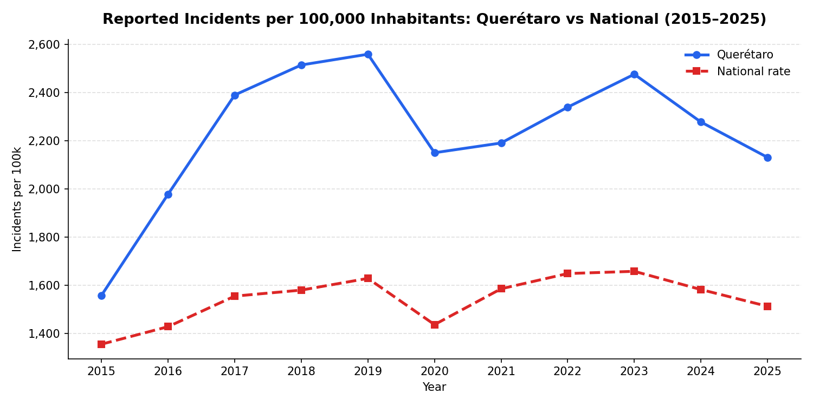
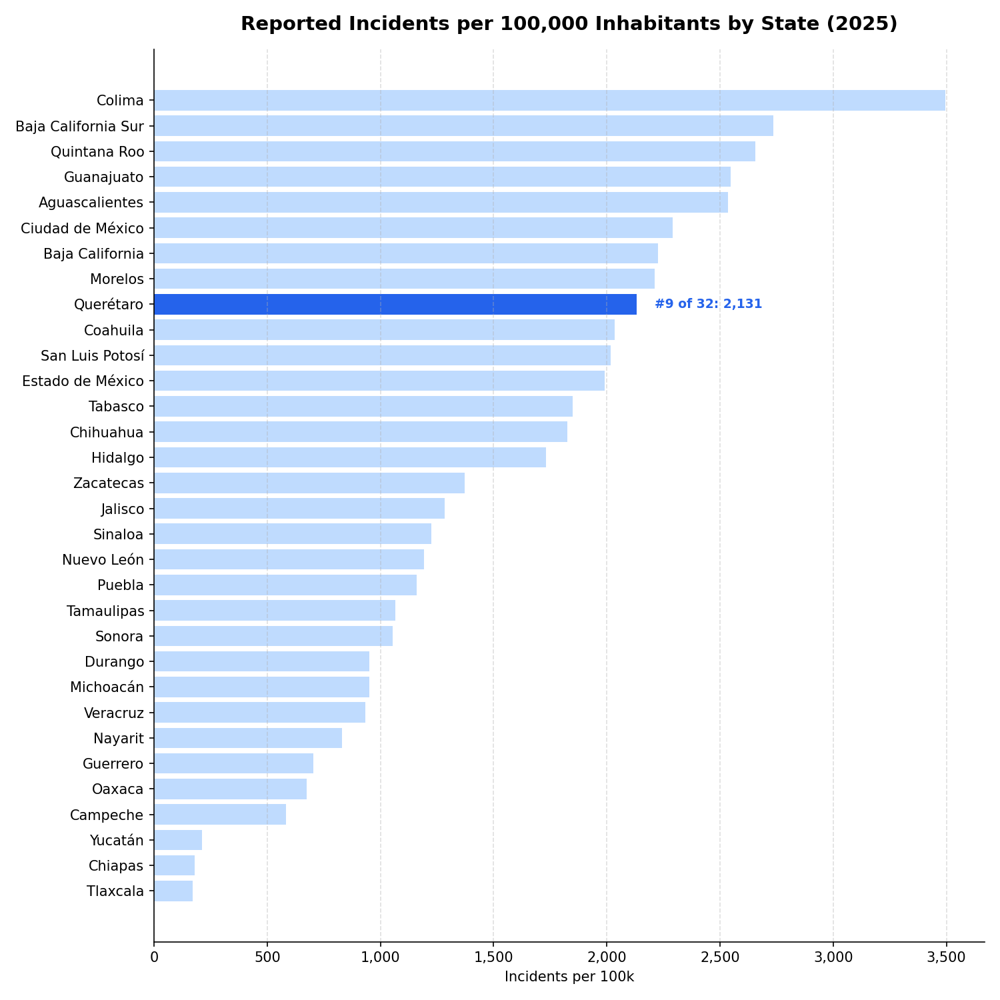
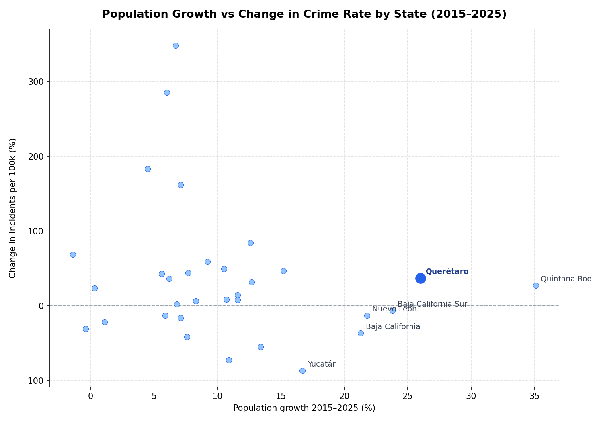
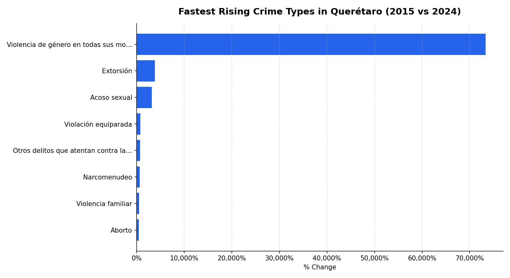
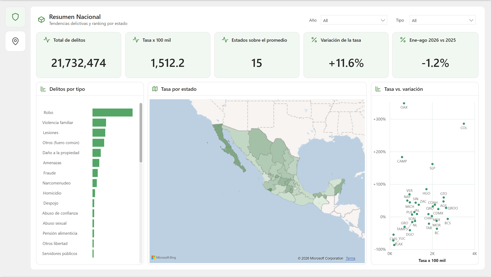
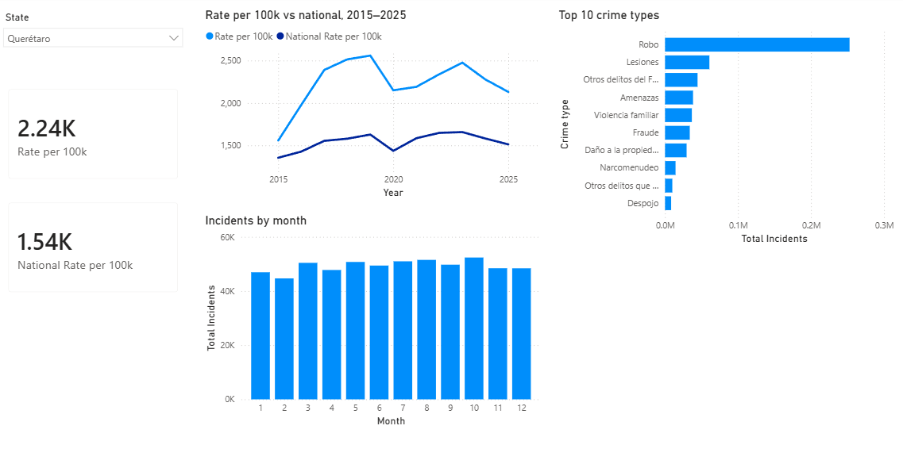

# Mexico Public Safety Analysis: Querétaro in National Context

Analysis of reported crime incidents across Mexico's 32 states from 2015 to 2025, using official federal data from the Secretariado Ejecutivo del Sistema Nacional de Seguridad Pública (SESNSP), with population denominators from CONAPO.

Querétaro, my home state, has gone through unusually fast population and industrial growth over the past decade. I wanted to know whether crime kept pace with that growth, and how the state really compares to the rest of the country once you control for population size.

The answer surprised me, and it reversed my own first conclusion.

---

## Key Findings

- **My first version of this analysis got the headline wrong.** Comparing raw incident counts, Querétaro sits comfortably below the "average state" every year. But that comparison flatters small states. Measured per 100,000 inhabitants, **Querétaro has been above the national rate every single year since 2015**, on average 44% higher, and ranked **#9 of 32 states in 2025**.
- Raw incidents grew **+72.3%** (32,817 → 56,559) between 2015 and 2025, but the population grew **+26%** over the same window. The per-capita increase is **+36.8%** (1,558 → 2,131 per 100k). Roughly half the headline growth was just more people.
- **Most of that per-capita rise is one step in 2016.** Monthly reports went from about 2,800 (January to May 2016) to about 4,100 (June to December) and stayed there. A jump that sudden may be a change in how crimes were recorded rather than a crime wave; I can't tell which from this data. From 2017 to 2025 the rate fell 10.8%.
- **Fast growth did not go with rising rates.** Among the five fastest-growing states, three (Baja California, Baja California Sur, Nuevo León) had lower reported rates in 2025 than in 2015. Querétaro (+37%) and Quintana Roo (+27%) did not. Five states is a small sample, so this is a pattern, not proof.
- **Robo (theft)** is Querétaro's largest category: 252,721 reports from 2015 to 2025, more than the next four categories combined.
- Seasonality is mild: counted per day, October is highest and January lowest, about a 12% gap. The busiest month changes from year to year.
- Gender-based violence shows the largest proportional increase of any category (2015 vs 2024). The 2015 baseline was tiny, so this mostly reflects changes in legal classification and reporting practice. The trend is real and worth flagging, but the raw percentage by itself is misleading.
- The per-capita rate has **declined since 2023** even as the population keeps growing. That is the most positive trend in the data.

---

## Charts

### Reported Crime Incidents by Year (2015–2025)


### Top 10 Crime Types (2015–2025)


### Seasonal Crime Patterns


### Querétaro vs National Rate per 100,000 Inhabitants


### All 32 States Ranked by Rate per 100k (2025)


### Population Growth vs Change in Crime Rate (2015–2025)


### Largest Relative Changes by Crime Category (2015 vs 2024)


---

## Interactive Dashboard (Power BI)

I rebuilt the analysis as a two-page Power BI dashboard so the same findings can be explored instead of read.

### Page 1: Mexico at a Glance


All 32 states ranked by rate per 100k, a filled map shaded by the same measure, and the national trend. Clicking any state on the map or the ranking filters the whole page.

### Page 2: State Deep Dive


One state against the national rate, its top 10 crime types, and monthly totals. Querétaro is 2,241 per 100k across the decade against a national 1,544.

The model is a star schema fed by `export_powerbi.py`: one fact table with lookup tables for state and year. The rates are DAX measures rather than calculated columns, so they respond to whatever the slicers select. A shared year table filters the incidents and population tables together, which is what keeps the per-100k figures correct when the year changes. The national comparison uses `REMOVEFILTERS` to ignore the state selection, so both numbers come from the same click.

The `.pbix` file is in `powerbi/`.

---

## Questions Explored

1. How have reported crime incidents in Querétaro changed year over year?
2. Once population growth is stripped out, is crime actually rising?
3. Which crime categories drive the totals?
4. Are there seasonal patterns by month?
5. How does Querétaro compare to the national rate, per capita, and where does it rank among all 32 states?
6. Do fast-growing states pay for their growth with more crime per person?

---

## Data Cleaning Notes

The raw files needed real work before they were queryable:

- The SESNSP yearly format is **wide** (one column per month), so I reshaped it into long format (one row per state-category-month-year) to make SQL queries reasonable.
- The 2026 file ships separately from the 2015–2025 historical file; both are concatenated during cleaning, and 2026 (January–February only) is excluded from all trend analysis.
- Spanish column headers were translated and standardized to snake_case during cleaning.
- The CONAPO population file covers 1950–2070 with one row per year × state × single age × sex (~740k rows). I filtered to 2015–2026, summed over age and sex, and normalized accented column names (AÑO → ANO) so the script doesn't depend on encoding behavior.
- CONAPO and SESNSP both use INEGI state codes (1–32), which is what makes the population JOIN reliable. Names like "Ciudad de México" vs "CDMX" never have to match.

---

## Project Structure

```
mexico-public-safety-analysis/
├── data/
│   ├── raw/                  ← original files from datos.gob.mx and CONAPO (untouched)
│   ├── cleaned/              ← reshaped incidents + population tables
│   └── mexico_safety.db      ← SQLite database (incidents, population, state_lookup)
├── sql/
│   └── queries.sql           ← 9 analytical queries with business-question headers
├── postgres/                 ← same data in PostgreSQL: schema, load script, notes
├── powerbi/
│   ├── mexico_safety_dashboard.pbix
│   └── screenshots/          ← both dashboard pages
├── output/
│   ├── charts/               ← 7 exported PNG charts
│   └── report.md             ← markdown report built by generate_report.py
├── analysis.py               ← cleans and reshapes the SESNSP crime data
├── clean_population.py       ← cleans the CONAPO population file
├── load_db.py                ← loads cleaned CSVs into SQLite
├── visualizations.py         ← generates all charts
├── generate_report.py        ← builds output/report.md from query results
├── export_powerbi.py         ← exports the star schema tables for Power BI
└── .gitignore
```

---

## Stack

Python (pandas) for loading and reshaping, SQLite for analytical queries, matplotlib for charts, Power BI for the dashboard. I went with SQLite instead of Postgres because the dataset fits comfortably in a single file and I wanted the repo to be self-contained. Anyone cloning it can run the whole pipeline without setting up a database server.

I later loaded the same data into PostgreSQL to work with a server-based database: declared column types, foreign keys, indexes and query plans. All nine queries return the same values on both. See `postgres/` for the schema and what was different. The Python scripts still use SQLite.

The per-capita queries are three-table JOINs: incidents need the state name from `state_lookup` **and** the matching year's population from `population`, joined on state code and year together.

---

## Data Sources

**Secretariado Ejecutivo del Sistema Nacional de Seguridad Pública (SESNSP)**: [datos.gob.mx](https://datos.gob.mx), *Cifras de incidencia delictiva estatal*.

- `Estatal-Delitos-2015-2025_feb2026.csv`: historical data 2015–2025
- `RNID-Delitos_Estatal-2026-feb2026.csv`: 2026 partial data (Jan–Feb)

**CONAPO**: *Proyecciones de la Población de México 1950–2070*, mid-year population by state, age, and sex.

- `0_Pob_Mitad_1950_2070.xlsx`: estimates reconciled with the censuses up to 2019 (*conciliación demográfica*), projections from 2020

All raw files are kept untouched in `data/raw/`.

---

## Limitations

- SESNSP figures reflect **reported** incidents only. Mexico has well-documented underreporting (the INEGI ENVIPE survey consistently estimates a "cifra negra" above 90% nationally), and reporting propensity varies enormously by state. The bottom of the per-capita ranking (Guerrero, Chiapas) is **not** a list of Mexico's safest states. It partly measures where people don't report. The ranking captures the interaction of crime and reporting behavior, not crime alone.
- Population figures for 2020 onward are CONAPO projections, not census counts. They are the standard denominators used in official rate calculations, but they carry projection uncertainty.
- Reporting standards and legal classifications changed during the analysis window; the gender-based violence category is the clearest example.
- 2025 data may still be revised in later SESNSP publications.

---

## How to Run

```bash
pip install -r requirements.txt

# 1. Clean and reshape the SESNSP crime data
py analysis.py

# 2. Clean the CONAPO population data (large file, takes a minute)
py clean_population.py

# 3. Load both into SQLite
py load_db.py

# 4. Generate charts
py visualizations.py

# 5. Generate report
py generate_report.py
```

Output appears in `output/charts/` and `output/report.md`.
